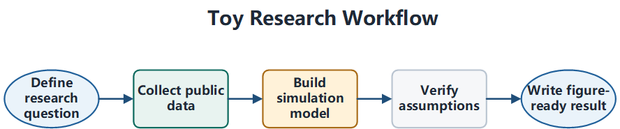
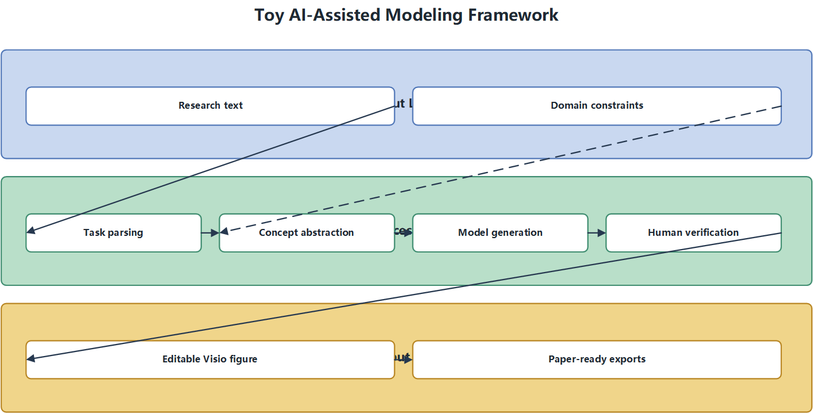
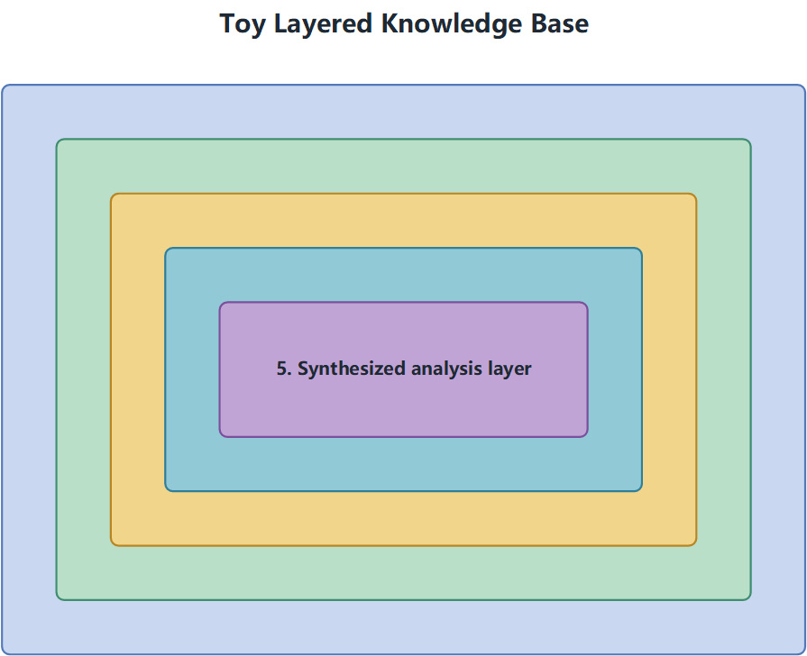
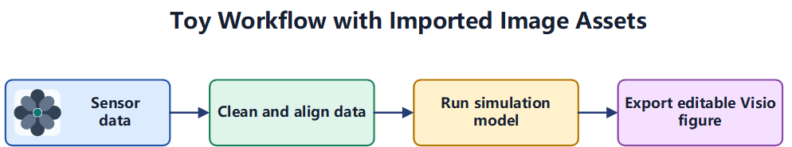

# Visio Scientific Figures

Editable Microsoft Visio scientific figures from structured specs.

把论文段落、框架草图或脱敏后的现有图，转成可编辑 `.vsdx`，并导出 `.png` / `.emf`，同时做版式与可读性检查。


## Quickstart

```powershell
python -m pip install -r requirements.txt
python .\skills\visio-scientific-figures\scripts\check_environment.py
python .\skills\visio-scientific-figures\scripts\validate_spec.py .\examples\toy_flowchart\figure_spec.yaml
python .\skills\visio-scientific-figures\scripts\render_spec.py .\examples\toy_flowchart\figure_spec.yaml
python .\skills\visio-scientific-figures\scripts\check_quality.py .\examples\toy_flowchart\output\toy_flowchart.vsdx --png .\examples\toy_flowchart\output\toy_flowchart.png --emf .\examples\toy_flowchart\output\toy_flowchart.emf --report .\examples\toy_flowchart\output\quality_report.md
```

Install into local agents:

```powershell
.\install-codex.ps1
.\install-claude-code.ps1
```

## Why This Repo Exists

- Keeps `.vsdx` as the source of truth instead of a flat screenshot.
- Generates common research diagram types from a reproducible `figure_spec.yaml/json`.
- Imports AI-generated or hand-drawn icons when Visio primitives are not enough.
- Checks for bounds errors, overlaps, text overflow, connector issues, and weak typography before you ship the figure.

## Featured Example

This repo includes an anonymized real-paper reconstruction instead of only toy boxes and arrows.


The example keeps the complexity of a journal-style framework figure while blurring the source reference and replacing private terms with neutral labels.

## Gallery

| Flowchart | Framework |
| --- | --- |
|  |  |

| Layered system | Image assets |
| --- | --- |
|  |  |

Refresh the gallery after rendering examples:

```powershell
python .\skills\visio-scientific-figures\scripts\make_gallery.py
```

## At a Glance

| Surface | Current state |
| --- | --- |
| Input | `figure_spec.yaml/json`, paper paragraph, sketch, or existing figure |
| Output | Editable `.vsdx` plus `.png` and `.emf` |
| Templates | `flowchart`, `framework`, `layered-system`, `matrix`, `mechanism` |
| QA | Bounds, overlaps, text overflow, contrast, detached arrows, connector-over-text |
| Asset path | Native Visio shapes plus imported bitmap icons/images |
| Best fit | Paper figures, thesis diagrams, system frameworks, workflow figures |

## Core Surface

Supported templates:

- `flowchart`
- `framework`
- `layered-system`
- `matrix`
- `mechanism`

Supported style packs:

- `nature-muted`
- `ieee-clean`
- `chinese-journal`
- `presentation-color`

Minimum spec shape:

```json
{
  "template": "flowchart",
  "title": "Figure title",
  "canvas": { "width_in": 7.5, "height_in": 4.8 },
  "style": "chinese-journal",
  "nodes": [{ "id": "input", "text": "Input" }],
  "groups": [],
  "connectors": [],
  "exports": { "dir": "output", "stem": "figure" }
}
```

Details live in:

- [`spec-format.md`](skills/visio-scientific-figures/references/spec-format.md)
- [`figure_spec.schema.json`](skills/visio-scientific-figures/schema/figure_spec.schema.json)
- [`quality-guidelines.md`](skills/visio-scientific-figures/references/quality-guidelines.md)
- [`image-assets.md`](skills/visio-scientific-figures/references/image-assets.md)

## How It Works

1. Write or generate `figure_spec.yaml/json`.
2. Run `validate_spec.py` before opening Visio.
3. Render `.vsdx`, `.png`, and `.emf` with `render_spec.py`.
4. Run `check_quality.py`.
5. Fix the spec, not the screenshot, until the report is clean.

## Repository Layout

- `skills/visio-scientific-figures/`: the actual skill package
- `skills/visio-scientific-figures/scripts/`: render, validate, quality, environment, gallery
- `skills/visio-scientific-figures/references/`: spec rules, recipes, quality guidance
- `examples/`: open-source-safe sample specs and assets
- `docs/gallery/`: tracked PNG previews for the README

## What Is Deliberately Not Here

- No hidden manual touch-up step after render.
- No bundling of real paper text, `.docx`, or undisguised project figures.
- No claim of cross-platform `.vsdx` generation yet. The current renderer is still Windows + Visio COM.

## Design Rules

- Prefer restrained journal typography over presentation-style fonts.
- Treat connector-over-text conflicts as defects, not acceptable noise.
- Keep generated images for icons or panels only; keep labels editable in Visio.
- Do not publish real manuscript text, source `.docx`, or undisguised project diagrams.

## Roadmap

- Add more research-native templates: neural architecture, attention mechanism, and data pipeline.
- Add an XML-based `.vsdx` backend for CI and non-Windows environments.
- Add incremental update mode for large figures instead of full document rebuilds.
- Split `chinese-journal` into more journal-specific variants once real style constraints are stable.

## Limits

- Rendering currently depends on Windows + Microsoft Visio + `pywin32`.
- CI-friendly XML backend generation is not implemented yet.
- The templates cover common research figures, not every architecture or attention diagram.

## Contributing

See [`CONTRIBUTING.md`](CONTRIBUTING.md) for development flow and verification expectations.

## License

MIT License.
